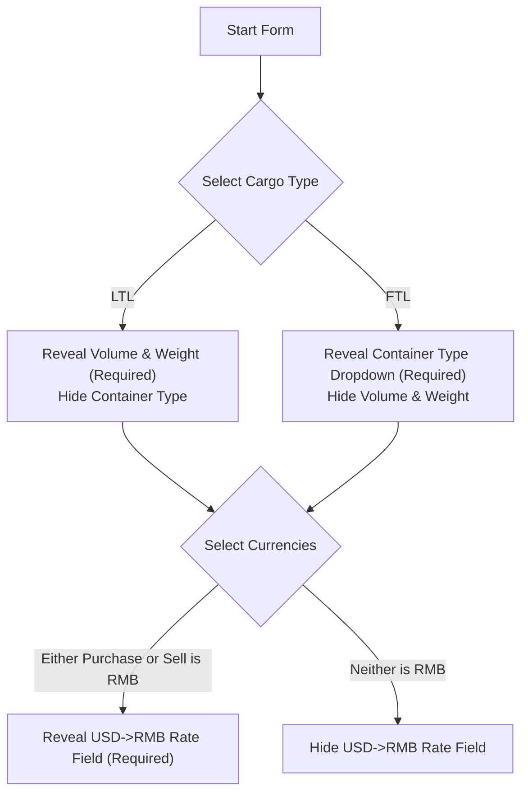

# Frontend Integration & API Specification: Unified Cargo Registrations

This document provides a comprehensive guide for frontend developers integrating the **Unified Cargo Registrations Module**. It details every endpoint, permission check, conditional field rendering rule, request/response schema, and error handling strategy.

---

## 1. Authentication & Permissions Overview

### Headers

All requests must include a valid JWT Bearer token:

```http
Authorization: Bearer <JWT_TOKEN>
Content-Type: application/json
```

### Module Permissions

The permission scope for this feature is `cargo_registrations`.

| Action                                      | Description                                                  | Default Roles      |
| :------------------------------------------ | :----------------------------------------------------------- | :----------------- |
| `cargo_registrations:create`                | Ability to submit new cargo registrations                    | CEO, ROP, EMPLOYEE |
| `cargo_registrations:read`                  | Ability to view cargo list and cargo details                 | CEO, ROP, EMPLOYEE |
| `cargo_registrations:update`                | Ability to update existing cargo registrations               | CEO, ROP, EMPLOYEE |
| `cargo_registrations:delete`                | Ability to delete cargo registrations                        | CEO, ROP           |
| `cargo_registrations:register_for_everyone` | Permission to register or assign cargos for **any** employee | CEO, ROP           |

> [!IMPORTANT]
> **Conditional UI Rendering: Employee Selector**
>
> - If `user.permissions.cargo_registrations.register_for_everyone === true` (or user is `CEO`/`ROP`):
>   - **UI Action**: Reveal the **Employee Selector** dropdown in the creation and editing forms. The user can select any active employee.
> - If `user.permissions.cargo_registrations.register_for_everyone === false` (Standard `EMPLOYEE`):
>   - **UI Action**: **Hide or lock** the Employee Selector. The cargo will automatically register under the logged-in user's `employee_id`. If shown, it should be disabled and locked to the logged-in user's profile.

### Retrieving User Permissions (`GET /auth/me`)

Yes! The **`GET /auth/me`** profile endpoint returns all user permissions, including `cargo_registrations`. The frontend should call this endpoint upon user login/app initialize to configure UI visibility rules.

#### Sample `GET /auth/me` Response:

```json
{
  "id": "u1234567-89ab-cdef-0123-456789abcdef",
  "username": "john_doe",
  "role": "EMPLOYEE",
  "permissions": {
    "clients": { "create": false, "read": true, "update": true, "delete": false },
    "employees": { "create": false, "read": true, "update": false, "delete": false },
    "cargo_registrations": {
      "create": true,
      "read": true,
      "update": true,
      "delete": false,
      "register_for_everyone": false
    }
  }
}
```

---

## 2. Field Specifications & Dynamic Form UI Behavior

To ensure a seamless user experience and prevent submitting invalid payloads, **frontend forms MUST dynamically show/hide input fields based on user selections**.



---

### Detailed Field Breakdown

| Field Name           | Type                                      | Required Case                                                                     | Dynamic UI Rule                                                                                                     |
| :------------------- | :---------------------------------------- | :-------------------------------------------------------------------------------- | :------------------------------------------------------------------------------------------------------------------ |
| `cargo_type`         | `Enum ("LTL" \| "FTL")`                   | **Always Required**                                                               | Primary toggle switch or radio button.                                                                              |
| `volume`             | `Number (> 0)`                            | **Required ONLY when `cargo_type === 'LTL'`**                                     | **Reveal ONLY when `cargo_type === 'LTL'`.** Hide when `FTL`.                                                       |
| `weight`             | `Number (> 0)`                            | **Required ONLY when `cargo_type === 'LTL'`**                                     | **Reveal ONLY when `cargo_type === 'LTL'`.** Hide when `FTL`.                                                       |
| `container_type`     | `Enum` _(22 Whitelisted Values)_          | **Required ONLY when `cargo_type === 'FTL'`**                                     | **Reveal ONLY when `cargo_type === 'FTL'`.** Hide when `LTL`. Select from allowed whitelist below.                  |
| `container_truck_id` | `String` `^[a-zA-Z0-9-]+$`                | **Always Required**                                                               | Letters, numbers, and hyphens only (e.g. `ABC-1234`, `40HQ-99`).                                                    |
| `agent_name`         | `String`                                  | **Always Required**                                                               | Accepts uppercase and lowercase text.                                                                               |
| `cargo`              | `String`                                  | **Always Required**                                                               | Text description of the goods/item being transported (e.g., `Textiles`, `Industrial Motors`).                       |
| `confirmed_date`     | `Date String (YYYY-MM-DD)`                | Optional                                                                          | Datepicker.                                                                                                         |
| `loaded_date`        | `Date String (YYYY-MM-DD)`                | Optional                                                                          | Datepicker.                                                                                                         |
| `arrived_date`       | `Date String (YYYY-MM-DD)`                | Optional                                                                          | Datepicker.                                                                                                         |
| `purchase_price`     | `Number (>= 0)`                           | **Always Required**                                                               | Non-negative numeric value.                                                                                         |
| `purchase_currency`  | `Enum ("UZS" \| "RUB" \| "USD" \| "RMB")` | **Always Required**                                                               | Select currency for purchase price.                                                                                 |
| `sell_price`         | `Number (>= 0)`                           | **Always Required**                                                               | Non-negative numeric value.                                                                                         |
| `sell_currency`      | `Enum ("UZS" \| "RUB" \| "USD" \| "RMB")` | **Always Required**                                                               | Select currency for sell price.                                                                                     |
| `usd_rmb_rate`       | `Number (> 0)`                            | **Required ONLY when `purchase_currency === 'RMB'` OR `sell_currency === 'RMB'`** | **Reveal ONLY when `purchase_currency === 'RMB'` OR `sell_currency === 'RMB'`.** Hide when neither currency is RMB. |
| `status`             | `Enum` *(Default `'Waiting'`)             | Optional                                                                          | Dropdown options: `Waiting`, `In Transit`, `Border`, `At Station`, `Delivered`.                                     |
| `description`        | `String`                                  | Optional                                                                          | Free text text-area for notes.                                                                                      |
| `client_id`          | `UUID`                                    | **Always Required**                                                               | Client selection dropdown.                                                                                          |
| `employee_id`        | `UUID`                                    | Required conditionally                                                            | **Reveal ONLY if user has `register_for_everyone` permission**. Defaults to current user if omitted.                |

---

### Allowed Whitelist for `container_type` (FTL Cargo)

When `cargo_type === 'FTL'`, the `container_type` dropdown MUST contain strictly these 22 options:

```json
[
  "40HQ",
  "40GP",
  "20GP",
  "20HQ",
  "45HQ",
  "96m3",
  "105m3",
  "110m3",
  "120m3",
  "130m3",
  "145m3",
  "Ref Fura",
  "air-delivery",
  "96 CBM",
  "105 CBM",
  "120 CBM",
  "130 CBM",
  "145 CBM",
  "40 GP",
  "40 HC",
  "45 HC",
  "127 CBM"
]
```

---

## 3. API Endpoints Reference

### 1. Create Cargo Registration

- **URL**: `POST /cargo-registrations`
- **Permission**: `cargo_registrations:create`

#### Request Payload Examples

##### Case A: LTL Cargo (No RMB)

```json
{
  "cargo_type": "LTL",
  "volume": 12.5,
  "weight": 1450,
  "container_truck_id": "TRK-9872",
  "agent_name": "SilkRoad Logistics",
  "cargo": "Electric Scooters",
  "confirmed_date": "2026-08-10",
  "loaded_date": "2026-08-12",
  "purchase_price": 4500,
  "purchase_currency": "USD",
  "sell_price": 6200,
  "sell_currency": "USD",
  "status": "Waiting",
  "description": "Fragile items, handle with care",
  "client_id": "b3e94420-15f1-4648-9c17-646ef67e2a90"
}
```

##### Case B: FTL Cargo with RMB Currency (Requires `usd_rmb_rate`)

```json
{
  "cargo_type": "FTL",
  "container_type": "40HQ",
  "container_truck_id": "CONTAINER-4091",
  "agent_name": "Shanghai Trans",
  "cargo": "Solar Panels",
  "confirmed_date": "2026-08-01",
  "loaded_date": "2026-08-04",
  "arrived_date": "2026-08-18",
  "purchase_price": 50000,
  "purchase_currency": "RMB",
  "sell_price": 9500,
  "sell_currency": "USD",
  "usd_rmb_rate": 7.235,
  "status": "In Transit",
  "client_id": "b3e94420-15f1-4648-9c17-646ef67e2a90",
  "employee_id": "8d3e21a4-3990-4109-8472-763428f52119"
}
```

---

### 2. Get All Cargo Registrations (Paginated & Filtered)

- **URL**: `GET /cargo-registrations`
- **Permission**: `cargo_registrations:read`

#### Query Parameters

| Parameter              | Type     | Example      | Description                                                                      |
| :--------------------- | :------- | :----------- | :------------------------------------------------------------------------------- |
| `page`                 | `Number` | `1`          | Page number (default `1`).                                                       |
| `limit`                | `Number` | `10`         | Page size (default `10`).                                                        |
| `offset`               | `Number` | `0`          | Skip offset.                                                                     |
| `search`               | `String` | `TRK-98`     | Searches across `container_truck_id` AND `cargo`.                                |
| `status`               | `String` | `In Transit` | Filter by status (`Waiting`, `In Transit`, `Border`, `At Station`, `Delivered`). |
| `cargo_type`           | `String` | `FTL`        | Filter by cargo type (`LTL`, `FTL`).                                             |
| `container_type`       | `String` | `40HQ`       | Filter by container type.                                                        |
| `client_id`            | `UUID`   | `b3e9...`    | Filter by client ID.                                                             |
| `employee_id`          | `UUID`   | `8d3e...`    | Filter by employee ID.                                                           |
| `confirmed_start_date` | `Date`   | `2026-08-01` | Confirmed date range start.                                                      |
| `confirmed_end_date`   | `Date`   | `2026-08-31` | Confirmed date range end.                                                        |
| `loaded_start_date`    | `Date`   | `2026-08-01` | Loaded date range start.                                                         |
| `loaded_end_date`      | `Date`   | `2026-08-31` | Loaded date range end.                                                           |
| `arrived_start_date`   | `Date`   | `2026-08-01` | Arrived date range start.                                                        |
| `arrived_end_date`     | `Date`   | `2026-08-31` | Arrived date range end.                                                          |

#### Response Schema `{ meta, data }`

```json
{
  "meta": {
    "total": 42,
    "limit": 10,
    "offset": 0,
    "calculated_net_yield": {
      "USD": 45200.0,
      "UZS": 12500000.0,
      "RUB": 0.0,
      "RMB": -50000.0
    },
    "gross_sales_revenue": {
      "USD": 128500.0,
      "UZS": 45000000.0,
      "RUB": 0.0,
      "RMB": 0.0
    }
  },
  "data": [
    {
      "id": "e4f1a239-20c1-4d33-91ab-b19c670f5e12",
      "container_truck_id": "TRK-9872",
      "agent_name": "SilkRoad Logistics",
      "client_full_name": "John Doe",
      "cargo": "Electric Scooters",
      "usd_rmb_rate": null,
      "employee_full_name": "Alice Smith",
      "purchase_price": {
        "amount": 4500,
        "currency": "USD"
      },
      "sell_price": {
        "amount": 6200,
        "currency": "USD"
      },
      "net_yield": {
        "amount": 1700,
        "purchase_currency": "USD",
        "sell_currency": "USD"
      },
      "status": "Waiting"
    },
    {
      "id": "7a8b9c0d-1e2f-3a4b-5c6d-7e8f9a0b1c2d",
      "container_truck_id": "CONTAINER-4091",
      "agent_name": "Shanghai Trans",
      "client_full_name": "Acme Corp",
      "cargo": "Solar Panels",
      "usd_rmb_rate": 7.235,
      "employee_full_name": "Bob Johnson",
      "purchase_price": {
        "amount": 50000,
        "currency": "RMB"
      },
      "sell_price": {
        "amount": 9500,
        "currency": "USD"
      },
      "net_yield": {
        "amount": -40500,
        "purchase_currency": "RMB",
        "sell_currency": "USD"
      },
      "status": "In Transit"
    }
  ]
}
```

---

### 3. Get Cargo Registration Details

- **URL**: `GET /cargo-registrations/:id`
- **Permission**: `cargo_registrations:read`

#### Response Schema

```json
{
  "id": "e4f1a239-20c1-4d33-91ab-b19c670f5e12",
  "cargo_type": "LTL",
  "volume": 12.5,
  "weight": 1450,
  "container_type": null,
  "container_truck_id": "TRK-9872",
  "agent_name": "SilkRoad Logistics",
  "cargo": "Electric Scooters",
  "confirmed_date": "2026-08-10",
  "loaded_date": "2026-08-12",
  "arrived_date": null,
  "purchase_price": 4500,
  "purchase_currency": "USD",
  "sell_price": 6200,
  "sell_currency": "USD",
  "net_yield": 1700,
  "usd_rmb_rate": null,
  "status": "Waiting",
  "description": "Fragile items, handle with care",
  "client_id": "b3e94420-15f1-4648-9c17-646ef67e2a90",
  "client": {
    "id": "b3e94420-15f1-4648-9c17-646ef67e2a90",
    "first_name": "John",
    "last_name": "Doe",
    "company_name": "Acme Global",
    "phone": "+998901234567",
    "email": "john@acme.com"
  },
  "employee_id": "8d3e21a4-3990-4109-8472-763428f52119",
  "employee": {
    "id": "8d3e21a4-3990-4109-8472-763428f52119",
    "first_name": "Alice",
    "last_name": "Smith",
    "position": "Senior Logistics Specialist"
  },
  "created_at": "2026-08-05T11:50:00.000Z",
  "updated_at": "2026-08-05T11:50:00.000Z"
}
```

---

### 4. Update Cargo Registration

- **URL**: `PATCH /cargo-registrations/:id`
- **Permission**: `cargo_registrations:update`

Accepts any subset of fields. Validation rules (LTL/FTL and RMB rate conditions) are re-evaluated against the updated record state.

#### Sample Request Payload

```json
{
  "status": "In Transit",
  "loaded_date": "2026-08-06"
}
```

---

### 5. Delete Cargo Registration

- **URL**: `DELETE /cargo-registrations/:id`
- **Permission**: `cargo_registrations:delete`

#### Sample Response

```json
{
  "message": "Cargo registration successfully deleted",
  "id": "e4f1a239-20c1-4d33-91ab-b19c670f5e12"
}
```

---

## 4. Error Handling Reference

| HTTP Code | Exception Location                      | Trigger Reason                                                                           | Frontend User Guidance                       |
| :-------- | :-------------------------------------- | :--------------------------------------------------------------------------------------- | :------------------------------------------- |
| `400`     | `volume_required_for_ltl`               | Missing or non-positive volume for LTL cargo                                             | Prompt user to enter volume > 0.             |
| `400`     | `weight_required_for_ltl`               | Missing or non-positive weight for LTL cargo                                             | Prompt user to enter weight > 0.             |
| `400`     | `container_type_required_for_ftl`       | Missing container type for FTL cargo                                                     | Prompt user to select container type.        |
| `400`     | `invalid_container_type`                | Selected container type is not in 22 allowed list                                        | Show error dropdown choice.                  |
| `400`     | `usd_rmb_rate_required`                 | Currency is RMB but `usd_rmb_rate` is missing or `<= 0`                                  | Reveal and highlight `USD->RMB rate` input.  |
| `403`     | `permission_denied_for_other_employees` | User without `register_for_everyone` tried assigning/updating cargo for another employee | Hide employee dropdown for restricted users. |
| `404`     | `cargo_not_found`                       | Invalid or deleted cargo ID                                                              | Redirect user to cargo list view.            |
