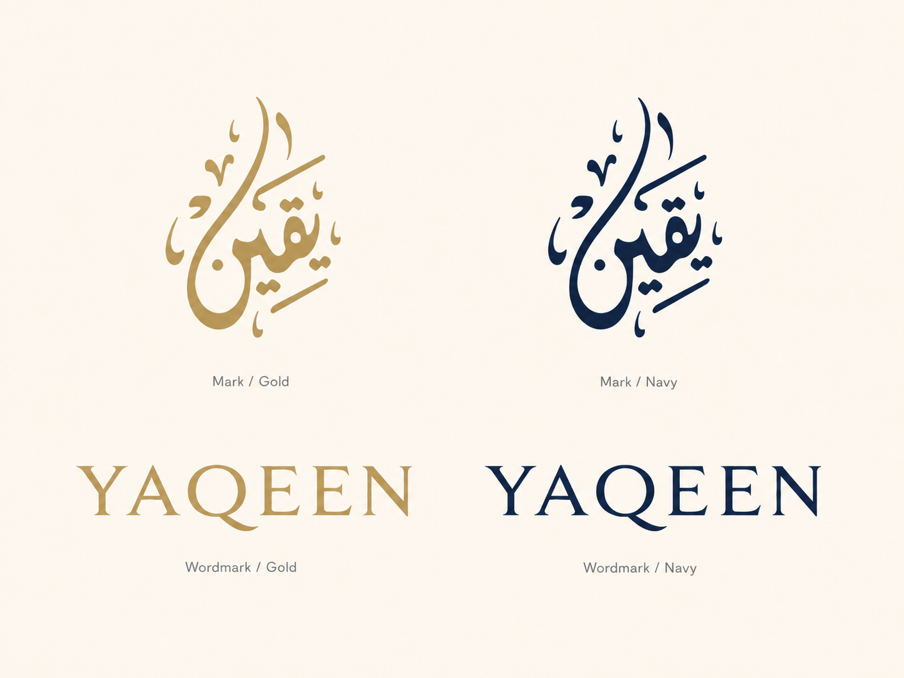
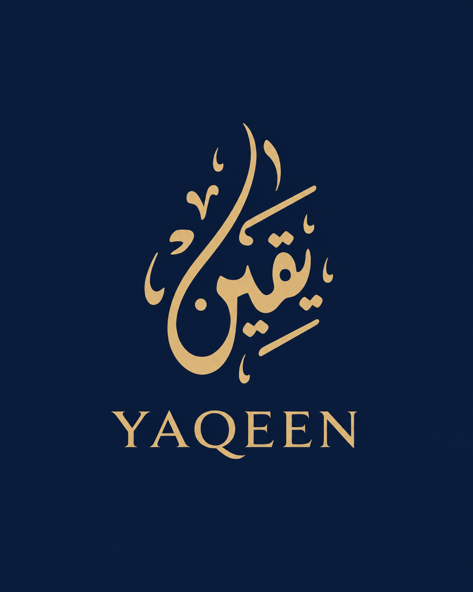
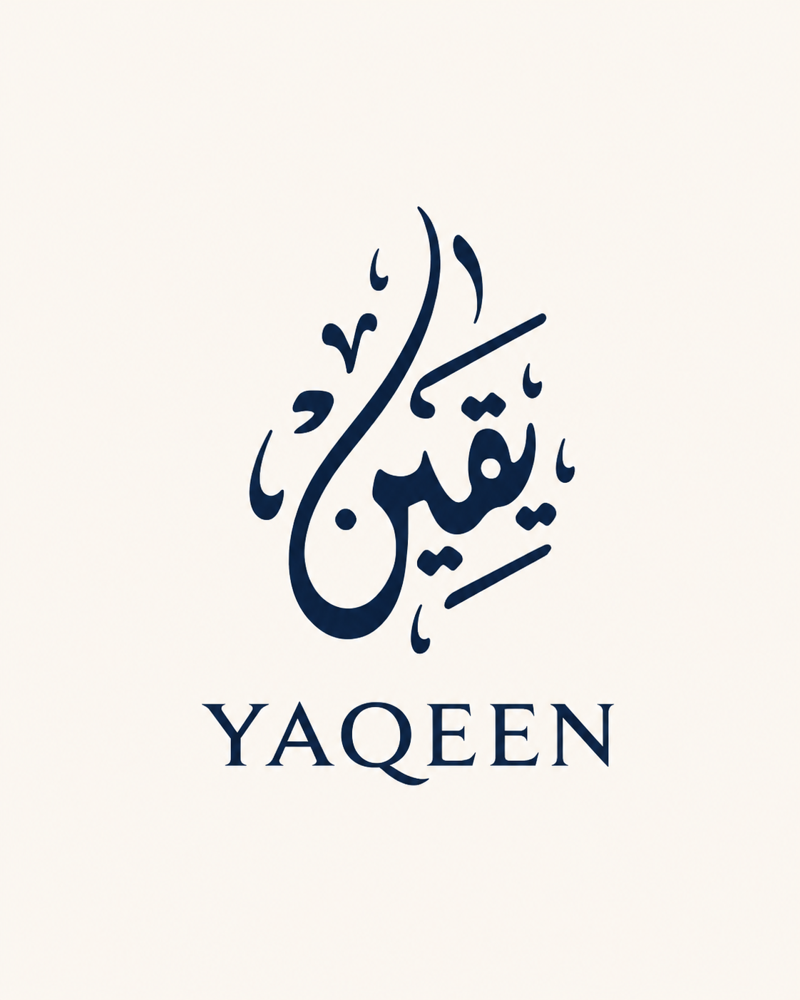
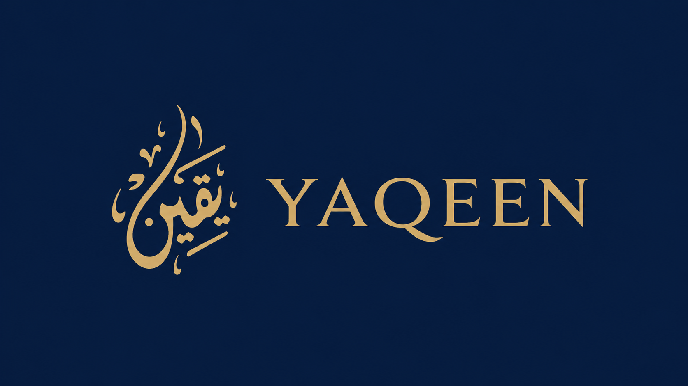
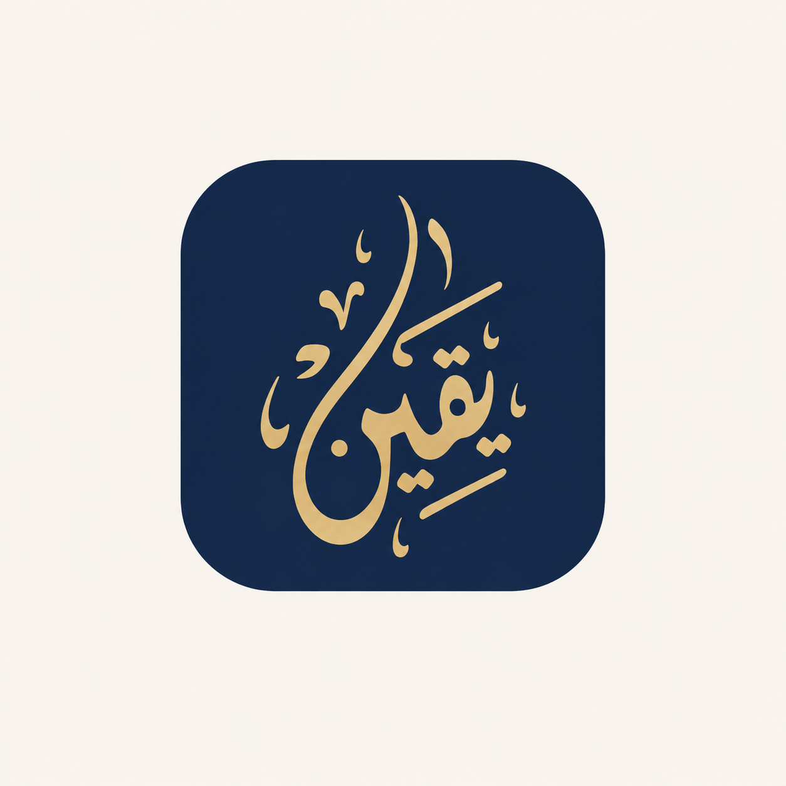
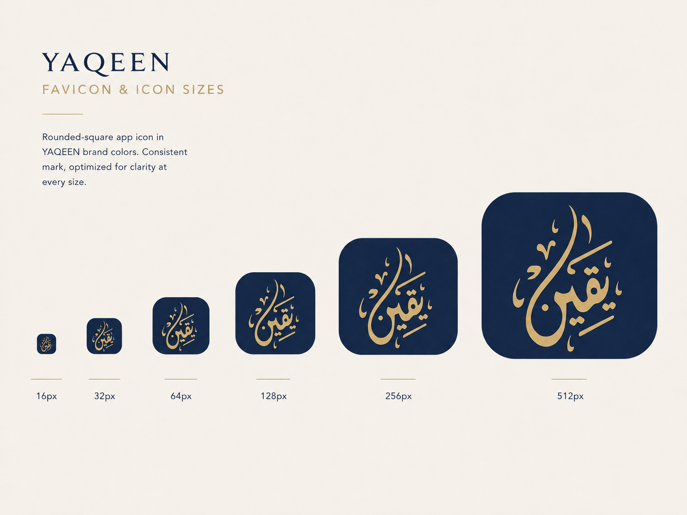

# Brand & Identity

[← Back to Main Index](../YAQEEN_DESIGN_SYSTEM.md)

---

# Brand Foundations

## Brand Essence

**Yaqeen** communicates certainty, confidence, calm, and trust.

The visual system is built around three complementary ideas:

1. **Heritage** — represented by Arabic calligraphy and ornamental structure.
2. **Confidence** — represented by deep blue, precise spacing, and stable layouts.
3. **Warmth** — represented by champagne gold and ivory rather than pure white.

## Brand Attributes

Use these attributes to evaluate visual and verbal decisions.

| Attribute   | The interface should feel        | It should not feel                |
| ----------- | -------------------------------- | --------------------------------- |
| Calm        | composed, ordered, spacious      | empty, passive, emotionless       |
| Trustworthy | stable, explicit, legible        | bureaucratic, rigid, intimidating |
| Refined     | polished, restrained, deliberate | luxurious for its own sake        |
| Modern      | responsive, efficient, clean     | trendy, temporary, generic        |
| Rooted      | culturally aware, meaningful     | themed, stereotypical, decorative |

## Brand Voice

The product voice should be:

- clear;
- respectful;
- reassuring;
- concise;
- precise;
- human.

Avoid exaggerated promotional language, slang, urgency without cause, or unnecessarily formal wording.

### Preferred

- “Your transfer is ready for review.”
- “We could not complete the payment. No funds were deducted.”
- “Welcome back, Ahmed.”
- “View account details.”

### Avoid

- “Amazing! Your awesome transfer is almost done!”
- “ERROR 502. Transaction failed.”
- “Click here.”
- “You must immediately verify everything.”

---

# Logo System

## Logo Assets

The reference board contains:

- the gold Arabic calligraphic mark;
- the Latin wordmark **YAQEEN**;
- a stacked lockup;
- a horizontal branded navigation lockup.

The calligraphic mark is the primary identity symbol. The wordmark provides Latin-script recognition.

## Approved Configurations

### Primary Stacked Lockup

Use the Arabic mark above the YAQEEN wordmark.

**Best for:**

- splash screens;
- launch screens;
- brand presentations;
- formal documents;
- centered hero areas;
- premium promotional cards.

### Horizontal Lockup

Use the Arabic mark to the left of the YAQEEN wordmark.

**Best for:**

- desktop navigation;
- application headers;
- website headers;
- email templates;
- narrow horizontal placements.

### Symbol Only

Use the Arabic mark without the wordmark only when the Yaqeen brand is already obvious.

**Best for:**

- app icons;
- favicons;
- avatars;
- compact sidebars;
- loading indicators;
- branded seals.

## Color Variants

### Gold on Deep Navy or Royal Blue

The preferred high-brand-impact treatment.

- Mark: Champagne Gold
- Background: Deep Navy or Royal Blue
- Optional pattern: same blue family at low contrast

### Deep Navy on Ivory

Preferred for light documents and low-decoration screens.

- Mark: Deep Navy
- Background: Ivory
- Wordmark: Deep Navy

### Single-Color Version

Use when production constraints prevent the primary treatment.

Approved single colors:

- Deep Navy;
- Royal Blue;
- white on sufficiently dark photography;
- black only for monochrome printing.

Do not simulate metallic gold with gradients unless the logo asset was specifically prepared for that output.

## Clear Space

**Standardized production rule**

Define `X` as the visual height of the tallest central calligraphic stroke.

Maintain at least:

- `0.5X` clear space on every side for symbol-only use;
- `0.75X` around stacked lockups;
- `0.5X` around horizontal lockups.

No text, border, icon, crop, or decorative motif may enter the clear-space area.

## Minimum Size

**Standardized production rule**

| Asset             |      Digital minimum |  Print minimum |
| ----------------- | -------------------: | -------------: |
| Symbol only       |           24 px high |      8 mm high |
| Horizontal lockup |          120 px wide |     32 mm wide |
| Stacked lockup    |           96 px wide |     26 mm wide |
| App icon artwork  | 64 px canvas minimum | Not applicable |

At small sizes, use a simplified symbol asset if the internal calligraphic detail becomes unclear.

## Logo Misuse

Do not:

- stretch, skew, rotate, or redraw the mark;
- change the relative scale of mark and wordmark;
- use unapproved colors;
- place gold on a low-contrast cream surface;
- place the logo over a visually busy image without a protective field;
- add heavy drop shadows, bevels, or glows;
- crop the calligraphy;
- place another symbol inside the logo clear space;
- use the logo as a repeating background pattern;
- replace the wordmark typography with a standard typed font.

---

# Content Design

## Voice Principles

### Clear

Use familiar words and direct sentence structure.

### Reassuring

State what happened and whether the user’s money or data is safe.

### Respectful

Avoid blame, condescension, or forced friendliness.

### Precise

Name the object and action.

### Concise

Remove words that do not help the user act.

## Capitalization

Recommended:

- sentence case for buttons, tabs, fields, card titles, and messages;
- title case only for formal marketing headings when deliberately chosen;
- uppercase only for short overline labels.

Examples:

- `Recent transactions`
- `New transfer`
- `Premium account`
- `TOTAL BALANCE` only as a small overline if needed

## Labels

Use nouns for destinations:

- Dashboard
- Accounts
- Transfers
- Payments
- Analytics
- Messages
- Settings

Use verbs for actions:

- Send money
- View details
- Save changes
- Download statement

## Error-Message Formula

**Problem + Impact + Recovery**

Example:

> We could not verify this account. Check the account number and try again.

For financial failures, explicitly state whether funds were moved.

## Dates and Times

- Use locale-aware format.
- Use relative dates only when unambiguous.
- Include year when records may span multiple years.
- Use exact time for security or transaction events.

## Truncation

- Avoid truncating financial values.
- Allow user names to wrap or provide full value on hover/focus.
- Truncate long account descriptions at a sensible boundary.
- Never truncate an error message without an expansion mechanism.
